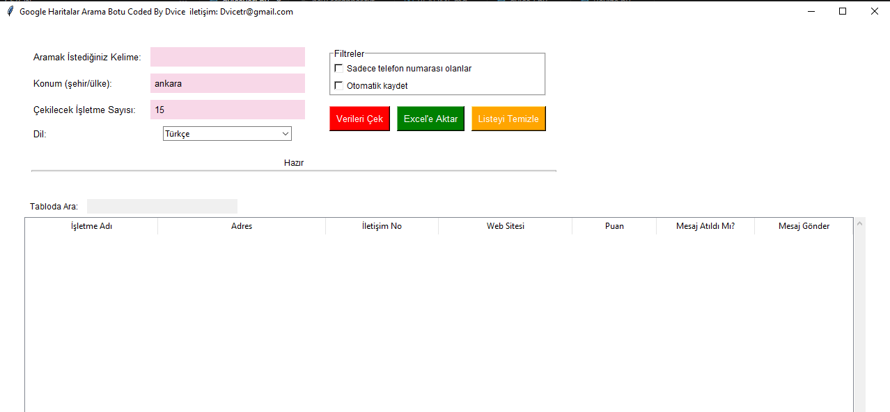
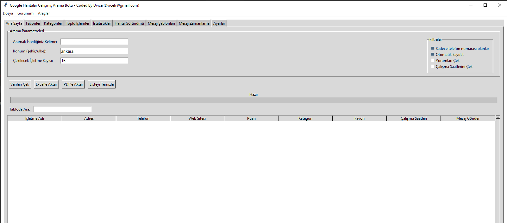

# Google Maps Arama Botu (Tkinter + Selenium)

Temel versiyondur Readme sonundaki Pro versiyonu satın almak için iletişim [muhammedharunseker@gmail.com](mailto:muhammedharunseker@gmail.com)

Bu proje, **Python**, **Tkinter** ve **Selenium** kullanılarak geliştirilmiş, Google Haritalar üzerinden işletme araması yapabilen ve bulunan işletmelere ait bilgileri tablo halinde listeleyip **Excel'e aktarabilen** masaüstü bir uygulamadır.

Ayrıca bulunan telefon numaraları üzerinden **WhatsApp Web** yönlendirmesi ile hızlı mesaj gönderme imkânı sunar.

> **Coded By:** Dvice  
> **İletişim:** [muhammedharunseker@gmail.com](mailto:muhammedharunseker@gmail.com)

---

## 🚀 Özellikler

* 🔍 Google Haritalar üzerinde anahtar kelime ile arama
* 🏢 İşletme adı, adres ve telefon numarası çekme
* 📊 Tkinter tabanlı modern tablo (Treeview) görünümü
* 📁 Verileri **Excel (.xlsx)** formatında dışa aktarma
* 💬 Tek tıkla **WhatsApp Web** üzerinden mesaj gönderme
* 🧵 Arka planda çalışan scraping (threading ile donma yok)
* 🎨 Siyah-beyaz & kırmızı ağırlıklı sade arayüz

---

## 🖥️ Arayüz Görünümü

* Üst panel:

  * Arama kelimesi girişi
  * Çekilecek işletme sayısı
  * **Verileri Çek** ve **Excel'e Aktar** butonları

* Alt panel:

  * İşletme Adı
  * Adres
  * İletişim Numarası
  * Mesaj Durumu
  * Mesaj Gönder butonu

---

## 📦 Gereksinimler

Python **3.9+** önerilir.

Gerekli kütüphaneler:

```bash
pip install selenium pandas
```

Ayrıca sisteminizde:

* Google Chrome yüklü olmalı
* Chrome sürümünüzle uyumlu **ChromeDriver** bulunmalı

> ChromeDriver'ı indirip PATH'e ekleyin veya script ile aynı klasöre koyun.

---

## ▶️ Kullanım

1. Projeyi klonlayın:

```bash
git clone https://github.com/dvicewashere/googlemaps_scrapper.git
cd googlemaps_scrapper
```

2. Uygulamayı çalıştırın:

```bash
python main.py
```

3. Açılan pencerede:

   * Aramak istediğiniz kelimeyi girin (örn: `ankara berber`)
   * Çekilecek işletme sayısını belirtin
   * **Verileri Çek** butonuna basın

4. İsterseniz sonuçları **Excel'e Aktar** butonu ile kaydedin

5. "Mesaj Gönder" sütununa tıklayarak WhatsApp Web üzerinden iletişime geçin

---

## 📊 Excel Çıktı Alanları

* İşletme Adı
* Adres
* İletişim No
* Mesaj Atıldı Mı?
* Mesaj Gönder

---

## 🎥 Uygulama Tanıtımı

<p align="center">
  
</p>

---
## Geliştirebilir şekilde dizayn edilmiştir.

<p align="center">
  
</p>

## Premium Versiyon

<p align="center">
  
</p>


## 📬 İletişim

Her türlü öneri, hata bildirimi veya geliştirme talebi için:

📧 **[muhammedharunseker@gmail.com](mailto:muhammedharunseker@gmail.com)**

---

